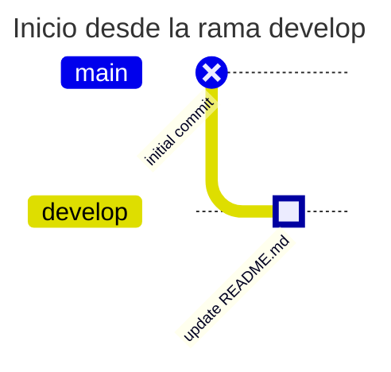
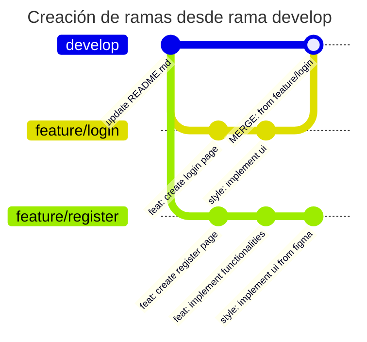

# Git Flow

## Ramas Principales

El desarrollo empieza desde la rama `develop`, ya que la rama `main` está protegida debido a que contiene los últimos cambios de la aplicación en fase de producción.

## Ramas de Desarrollo

Desde la rama `develop` se crearán ramas de acuerdo con las funcionalidades que se estén desarrollando. Una vez terminadas todas las funcionalidades de la rama respectiva, se puede realizar un merge apuntando a la rama **develop**.

